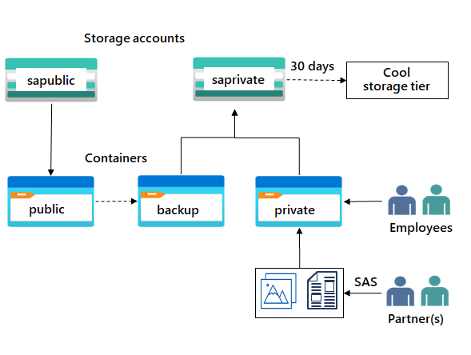

---
lab:
    title: 'Exercise 02b: Provide private storage for internal company documents'
    module: 'Guided Project - Azure Files and Azure Blobs'
---

The company needs storage for their offices and departments. This content is private to the company and shouldn't be shared without consent. This storage requires high availability if there's a regional outage. The company wants to use this storage to back up the public website. 

## Architecture diagram

## Skilling tasks
- Create a storage account.
- Create a storage container with restricted access.
- Configure a shared access signature for partners.
- Back up the public website storage.
- Implement lifecycle management to move content to the cool tier.

## Exercise instructions

> **Note**: These instruction require you to have completed **Lab 02a**, Provide storage for internal documents.

1. Create a storage account for the internal private company documents.
    - In the portal, search for and select **Storage accounts**.  
    - Select **+ Create**. 
    - Select the **Resource group** created in the previous lab.   
    - Set the **Storage account name** to **private**. Add an identifier to the name to ensure the name is unique. 
    - Select **Review**, and then **Create** the storage account. 
    - Wait for the storage account to deploy, and then select **Go to resource**.

1. This storage requires high availability if there's a regional outage. Read access in the secondary region is not required. Configure the appropriate level of **redundancy**. [Learn more about storage account redundancy](https://learn.microsoft.com//azure/storage/common/storage-redundancy).

    - In the storage account, in the **Data management** section, select the **Redundancy** blade. 
    - Ensure **Geo-redundant storage (GRS)** is selected.
    - **Refresh** the page. 
    - Review the primary and secondary location information. 
    - **Save** your changes.

1. Create a private storage container for the corporate data. 

    - In the storage account, in the **Data storage** section, select the **Containers** blade. 
    - Select **+ Container**. 
    - Ensure the **Name** of the container is **private**.
    - Ensure the **Public access level** is **Private (no anonymous access)**.
    - As you have time, review the **Advanced** settings, but take the defaults. 
    - Select **Create**. 

1.  For testing, upload a file to the **private** container. he type of file doesn't matter. A small image or text file is a good choice. Test to ensure the file isn't publically accessible. 

    - Select the container.
    - Select **Upload**.
    - **Browse to files** and select a file.
    - **Upload** the file.
    - Select the uploaded file.
    - On the **Overview** tab, copy the **URL**.
    - Paste the **URL** into a new browser tab. 
    - Verify the file doesn't display and you receive an error. 

1. An external partner requires read and write access to the file for at least the next 24 hours. Configure and test a shared access signature (SAS). [Learn more about Shared Access Signatures](https://learn.microsoft.com/rest/api/storageservices/delegate-access-with-shared-access-signature).

    - Select your uploaded blob file and move to the **Generate SAS** tab. 
    - In the **Permissions** drop-down, ensure the **Read** and **Write** permissions are selected. 
    - Verify the **Start and expiry date/time** is for the next 24 hours. 
    - Select **Generate SAS token and URL**.
    - Copy the **Blob SAS URL** to a new browser tab.
    - Verify you can access the file. If you have uploaded an image file it will display in the browser. Other file types will be downloaded.
    
1. To save on costs, after 30 days, move blobs from the hot tier to the cool tier. [Manage the Azure Blob storage lifecycle](https://learn.microsoft.com/training/modules/manage-azure-blob-storage-lifecycle/).

    - Return to the **storage account**.
    - In the **Data management** section, select the **Lifecycle management blade**.
    - Select **Add rule**. 
    - Set the **Rule name** to **movetocool**.
    - Set the **Rule scope** to **Apply rule to all blobs in the storage account**.
    - Select **Next**.
    - Ensure **Last modified** is selected.
    - Set **More than (days ago)** to **30**.
    - In the **Then** drop-down select **Move to cool storage**.
    - As you have time, review other lifecycle options in the drop-down. 
    - **Add** the rule.
  
1. The public website files need to be backed up to another storage account. [Learn more about object replication](https://learn.microsoft.com/azure/storage/blobs/object-replication-overview).

    - In your storage account, create a new container called **backup**. Use the default values.
    - Navigate to your **publicwebsite** storage account. This storage account was created in the previous exercise. 
        - In the **Data management** section, select the **Object replication** blade. 
        - Select **Create replication rules**.
        - Set the **Destination storage account** to the **private** storage account.
        - Set the **Source container** to **public** and the **Destination container** to **backup**.
        - **Create** the replication rule. 
    - Optionally, as you have time, upload a file to the **public** container. Return to the **private** storage account and refresh the **backup** container. Within a few minutes your public website file will appear in the backup folder. 

>**Note**: For additional practice complete the [Configure Azure blob storage](https://learn.microsoft.com/training/modules/configure-blob-storage/) module. The module has an interactive lab simulation where you can get more practice creating blob storage. 

