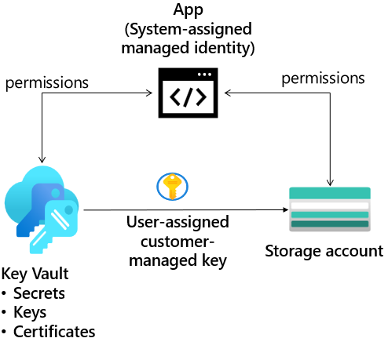

---
lab:
    title: 'Exercise 04: Provide storage for a new company app     '
    module: 'Guided Project - Azure Files and Azure Blobs'
---

# Provide storage for a new company app

The company is designing and developing a new app. Developers need to ensure the storage is only accessed using keys and managed identities. The developers would like to use role-based access control. To help with testing, protected immutable storage is needed. 

## Architecture diagram

## Skilling tasks

- Create a storage account. 
- Configure a user-assigned managed identity. 
- Configure a system-assigned managed identity.
- Configure a key vault with key. 
- Configure a container with immutable storage.
- Configure an encryption scope. 

## Exercise instructions

>**Note**: To complete this lab you will need an [Azure subscription](https://azure.microsoft.com/free/).

### Create the storage account for the developers.

1. Provide a storage account for the app. 

    - Search the portal for **Storage accounts**. 
    - Select **+ Create**.
    - For **Resource group** select **Create new**. Give your resource group a **name** and select **OK** to save your changes.
    - Provide a **Storage account name**. Ensure the name is unique and meets the naming requirements. 
    - **Review**, and then **Create** the storage account.
    - Wait for the resource to deploy.

### Create and configure a managed identity to access to the storage account.

1. Provide a user-assigned managed identity for the storage to use.  [Learn more about managed identities](https://learn.microsoft.com/azure/active-directory/managed-identities-azure-resources/overview).

    - Search for and select **Managed identities**.
    - Select **Create**.
        - Use your new **resource group**. 
        - Give your managed identity a name.
    - Select **Review and create**, and then **Create**. 

1. Assign the correct permissions to the user-assigned managed identity. The identity only needs to read and list containers and blobs. [Learn more about how to assign Azure roles](https://learn.microsoft.com/azure/role-based-access-control/role-assignments-portal).
    
    - Search for and select your **storage account**.
    - Select the **Access Control (IAM)** blade.
    - Select **Add role assignment** (center of the page).
    - Search for and select the **Storage Data Blob Reader** role. 
    - On the **Members** tab, select **Managed identity**.
    - Select **Select members**, i the **Managed identity** drop-down select **User-assigned managed identity**.
    - Select the managed identity you created in the previous step. 
    - Click **Select** and then **Review + assign** the role. 
    - Select **Review + assign** a second time to add the role assignment.
    - Your storage account can now be accessed by a managed identity with the Storage Data Blob Reader permissions. 

### Secure access to the storage account with a key vault and key

1. To create the key vault and key needed for this part of the lab, your identity must be Key Vault Administrator. Learn more, [Provide access to Key Vault keys, certificates, and secrets with an Azure role-based access control](https://learn.microsoft.com/azure/key-vault/general/rbac-guide?tabs=azure-cli)

1. Create a key vault to store the access keys. [Learn more about the Azure Key Vault](https://learn.microsoft.com/azure/key-vault/general/overview).

    - In the portal, search for and select **Key vaults**.
    - Select **Create**.
    - Select your **resource group**.
    - Provide the **name** for the key vault. The name must be unique. 
    - Select **Review + create**, and then **Create**.
    - After the deployment, select **Go to resource**. 

1. Create a customer-managed key in the key vault. [Learn more about Azure Key Vault keys, secrets and certificates](https://learn.microsoft.com/azure/key-vault/general/about-keys-secrets-certificates).

    - Select your key vault.
    - In the **Objects** section, select the **Keys** blade.
    - Select **Generate/Import** and **Name** the key.
    - Take the defaults for the rest of the parameters, and **Create** the key.

1. Configure the storage account encryption to use customer managed keys in your key vault. [Learn more about customer managed keys on an existing storage account](https://learn.microsoft.com/azure/storage/common/customer-managed-keys-configure-existing-account?WT.mc_id=Portal-Microsoft_Azure_Storage&tabs=azure-portal).

    - Select the storage account and the **Encryption** blade.
    - On the **Encryption** tab, select **Customer-managed keys**.
        - Select your key vault and key. 
        - Ensure the **Identity type** is **System-assigned**
        - **Save** your changes. 

### Configure an time-based retention immutable storage policy.

1. The developers require a storage container where files can't be modified, even by the administrator. [Learn more about blob immutable storage](https://learn.microsoft.com/azure/storage/blobs/immutable-storage-overview).

    - In your storage account, select the **Container** blade. 
    - Create a container called **hold** and upload a file to the container. 
    - From the **Overview** blade of your container, select the **Access policy** blade. 
    - In the **Immutable blob storage** section, select **+ Add policy**. 
    - For the **Policy type**, select **time-based retention**. 
    - Set the **Retention period** to **5 days**. 
    - Be sure to **Save** your changes. 
    - Try to remove the file in the container. 
    - Verify you can't delete the file due to policy. 

### Configure an encryption scope that enables infrastructure encryption

1. The developers require an encryption scope that enables infrastructure encryption. [Learn more about infrastructure encryption](https://learn.microsoft.com/azure/storage/common/infrastructure-encryption-enable?tabs=portal).

    - Continue working with your new storage account. 
    - In the **Security + networking** blade, select **Encryption**.
     -In the **Encryption scopes** tab, select **Add**.
        - Give your encryption scope a **name**. 
        - The encryption type is **Microsoft-managed key**.
        - Set infrastructure encryption to **Enable**. 

>**Note**: For additional practice complete the [Secure and isolate access to Azure resources by using network security groups and service endpoints](https://learn.microsoft.com/training/modules/secure-and-isolate-with-nsg-and-service-endpoints/) module. The module has a sandbox where you can get more practice restricting access to storage.
